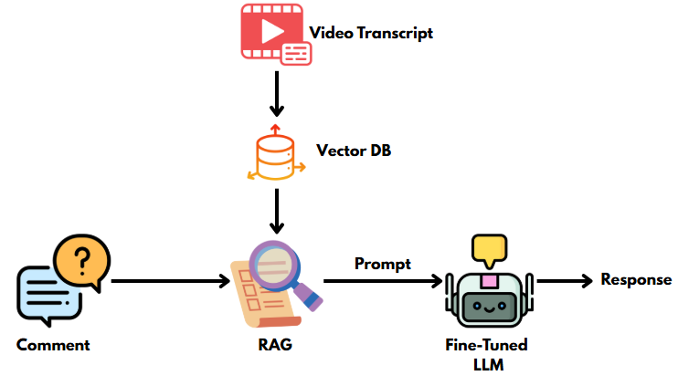

# 🤖 YouTube Comment Responder Bot

Have you ever left a thoughtful comment under a tech video on YouTube and received no reply? I have too. This project was born out of that experience.

## 📌 Motivation

I created RespondAI🤖 to fix the issue as a viewer, I often left detailed comments/questions, feedback but rarely got a response because content-creators are overwhelmed by the sheer volume of comments. RespondAI🤖 bridges this gap by automatically generating thoughtful replies for the viewers.

## 💡 Project Overview

RespondAI🤖 is a YouTube comment responder bot designed to automatically reply to comments. It uses a combination of:

* **Fine-tuned Mistral-7B-Instruct** (via LoRA) for personalized, context-aware responses.
* **Retrieval-Augmented Generation (RAG)** with YouTube video transcripts as the knowledge source.
* **Unified prompting strategy** that leverages transcript context for technical questions while producing concise acknowledgments for general comments.

This system addresses the challenge of engaging with viewers at scale while maintaining relevance, clarity, and brevity.

---

## Features

1. **Fine-Tuned Language Model**

   * Utilizes Mistral-7B-Instruct with LoRA on a dataset of YouTube comment–response pairs [`YT-comments.csv`](https://github.com/ShawhinT/YouTube-Blog/blob/main/LLMs/qlora/data/YT-comments.csv) on Kaggle.
2. **RAG with Transcripts**

   * Fetches and formats YouTube auto- or manual captions.
   * Extracts dialogue segments (UTF-8) into a clean transcript.
   * Indexes transcripts using a embedding model (`BAAI/bge-small-en-v1.5`).
3. **Unified Prompting Strategy**

   * Single prompt template that includes context for technical questions and instructs short replies for general comments.
⚠️ Currently, the comment type is inferred from the prompt instructions. No explicit classification model is used yet.

---

## Architecture

---

## 🛠️ Potential Improvements

* 🔍 **Chunked Retrieval:** Break long transcripts into smaller, semantically meaningful chunks to improve retrieval accuracy.
* **🛡️ Bot Moderation:** Filter spam or toxic comments before responding.
* **🌐 Multi-language Support:** Extend caption extraction and responses to non-English comments.
* **📏 Adaptive Length Control:** Dynamically adjust response length based on comment type.

---

**Credits:** This project was inspired by the incredible content shared by [Shaw Talebi](https://medium.com/data-science/qlora-how-to-fine-tune-an-llm-on-a-single-gpu-4e44d6b5be32)
